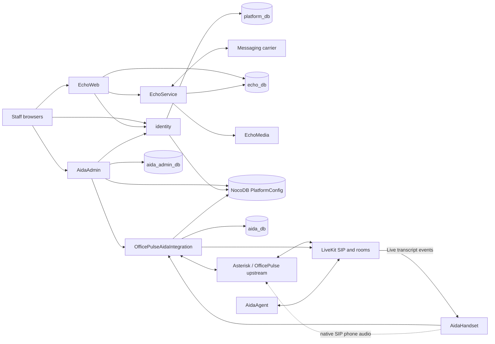

# Unified office Voice and Messaging platform

Current delivery: [first-wave implementation PRs, test evidence and remaining acceptance work](LOCAL_DEV_READINESS.md). The design below is the target; it does not claim the composed POC is already deployed.
Review date: 2026-09-06. Status: proposed implementation baseline, incorporating the owner's decisions in this review. This document describes the target and the work remaining; it is not evidence of a deployed combined POC.

The platform shares people, business tenants, access policy, configuration, and release operations. Echo supplies messaging; Aida supplies voice. Keep the working Echo implementation and reuse the existing AidaAdmin and OfficePulse code. Build the missing Agent and Handset. OfficePulseAidaIntegration is the sole voice runtime orchestrator for this POC; a separate AidaControl process is deferred.

## Decisions confirmed by the owner

- Preserve existing Echo data and access through consolidation.
- Demonstrate several businesses from the first combined POC. SUPER ADMIN sees all businesses. Ordinary users and tenant administrators see only authorized businesses.
- Obtain and develop Aida locally on `dockerappvm01-dev`.
- Keep call orchestration in OfficePulseAidaIntegration for the POC.
- Use `X.TLD` in reusable code and specifications; deploy development under `localsplash.dev` and production under `localsplash.ai`.
- Treat Asterisk and its vendor database as an independent upstream project. Use supported provisioning and customization; do not redesign or migrate its vendor schema.

## What the review actually found

| Repository | Evidence on 2026-09-06 | POC treatment |
| --- | --- | --- |
| identity | Implemented OAuth handoff, user directory, sessions and events. Healthy local service. Local checkout has substantial uncommitted setup/deployment changes absent from GitHub main. | Reuse; first preserve and reconcile local behavior, then add central tenants and shared configuration. |
| EchoOrchestrator | Working Compose/scripts and healthy Echo containers on this host. | Seed the shared release composition from this implementation. |
| EchoDatabase | Existing MySQL data, migration scripts and message routines. | Keep sole ownership of Echo DDL and preserve all existing domain IDs. |
| EchoWeb | Uses Identity for sign-in but maintains local users, organizations, memberships and sessions. | Add canonical user/tenant mappings, access checks and Identity event handling. |
| EchoService | Working carrier/webhook/message integration and existing settings reader. | Preserve messaging; migrate configuration and enforce scoped administrative access. |
| EchoMedia | Implemented public file server; no existing settings reader. | Add the intended configuration reader and define separate user-media and carrier-fetch access. |
| AidaAdmin | Implemented UI/API; already calls OfficePulse rather than AidaControl. Own PostgreSQL state/session store and legacy NocoDB identity/config access. | Reuse UI; consolidate identity/tenancy and migrate its owned state to MySQL. |
| OfficePulseAidaIntegration | Implemented TypeScript FastAGI/ARI/provisioning/runtime service, MySQL storage and automated tests. Remote POC runtime not inspected. | Reuse and complete runtime/client contracts; validate against the actual PBX and LiveKit. |
| AidaControl | Repository empty. | Reserve for a future extraction; remove it from POC deployment dependencies. |
| AidaAgent | Current repository contains a README only. | Build the LiveKit voice worker; a metadata check is insufficient. |
| AidaHandset | Current repository contains a README only. | Build the Android app; a contract check is insufficient. |
| AidaInfrastructureSetupInstructions | Main is documentation only; PR #16 revises documents but remains inconsistent with implemented Aida ownership. | Own this plan, versioned contracts, deployment composition and acceptance evidence. |

Healthy Docker status confirms process health only. It does not prove an inbound call, transcript delivery, takeover, tenant isolation, or outbound message. No remote Aida call was observed during the review. See [local readiness and source reviews](LOCAL_DEV_READINESS.md) for source-level evidence, exact local checkouts and build/test results.

The current issues are a storage-standard change set, not a complete POC backlog. In particular, OfficePulse #10, Agent #7 and Handset #8 incorrectly imply that compatibility verification finishes those applications. [Issue set](https://github.com/localsplash/AidaInfrastructureSetupInstructions/issues/15), [OfficePulse orchestration decision](https://github.com/localsplash/OfficePulseAidaIntegration/issues/9).

## Consolidated session authority

Users, organizations (called tenants in APIs), memberships and authoritative staff sessions all belong to Identity in `platform_db`. EchoWeb and AidaAdmin browser cookies carry opaque central application-session tokens; they do not maintain independent login or membership truth. Identity introspection resolves the current user, selected business and current memberships. Application databases keep only business data, OAuth handoff state, audit and migration mappings. Device bearer credentials remain limited runtime capabilities tied to an enrolled extension, not a second staff identity directory.

Breaking application contracts is acceptable during this development rebuild; preserve business data and explicit legacy ID mappings.

## Runtime and repository boundaries

Arrows describe responsibilities, not permission for browsers or handsets to access stores. Detailed settings readers and private service routes are specified in the data standard.

Keep these application repositories and containers separate. AidaAdmin is the staff administration surface; EchoWeb remains the working messaging UI. Share navigation, domain/branding configuration, identity and tenant selection. A visual redesign or merging both UIs into one codebase is not a prerequisite for the POC. AidaControl can later be extracted from OfficePulse if scaling or ownership requires it, using the same contracts.

Functionally merge **deployment ownership** into AidaInfrastructureSetupInstructions. Port the useful EchoOrchestrator Compose, backup and migration behavior there; leave EchoOrchestrator as the compatibility entry point until the new composition is proven. Do not run two stacks that both claim the same containers or volumes. No orchestration application container is needed.

For a fresh install, one pinned MySQL 8 release may host the platform, Echo, voice runtime and admin databases with distinct users/grants. On this existing host, retain the working Identity and Echo MySQL containers initially. Sharing a physical database server is independent of sharing tenant IDs. Database-server consolidation can follow the POC without another application redesign.

Use a small repeatable operator workflow: preflight, initialize stores, initialize configuration, apply each owner's migrations, start a pinned release, run acceptance, restore. A large installer, Kubernetes, service mesh and monorepo conversion are unnecessary at this stage.

## Data and access ownership

The [Platform Data Standard](PLATFORM_DATA_STANDARD.md) controls storage and migration rules.

| Data | Canonical store | Schema owner / permitted writer |
| --- | --- | --- |
| People, provider identities, SSO and application sessions, tenants, tenant memberships, Identity event outbox | `platform_db`, `identity_tbl_*` | identity only, accessed through its API |
| Deployment configuration, credentials and Aida desired configuration | NocoDB `PlatformConfig` | identity owns base/`cfg_tbl_Setting`; each named application owns its own settings and configuration tables |
| Messages, conversations, carrier state and legacy-to-platform mappings | `echo_db` | EchoDatabase owns DDL; EchoWeb and EchoService have explicit, limited runtime grants |
| Calls, command ledger, event sequences, device sessions, voice provisioning state | `aida_db` | OfficePulseAidaIntegration |
| AidaAdmin OAuth state, event cursor/deduplication, staff-operation audit | `aida_admin_db` | AidaAdmin; migrate existing PostgreSQL state deliberately |
| SIP endpoint/auth/AOR records, dialplan, CDR/CEL | Existing upstream Asterisk stores | Upstream schema; OfficePulse adapter provisions only approved rows through supported interfaces |
| Live transcript text | LiveKit delivery and handset memory for POC | Agent publishes; historical transcript storage is a separate explicit feature |
| MMS/attachments and voice recordings | Explicit media volumes/storage with domain access policy | EchoMedia for messaging; existing PBX recording owner for voice |

Identity is the sole authority for business membership. Aida tenant profiles contain voice preferences, Asterisk context and caller-ID defaults, not another authoritative tenant or membership record. Device-to-extension and app-specific capability mappings remain application data.

For existing records, retain Echo `iOrgId` and local user/message IDs, then add explicit mappings to canonical `iTenantId` and `iUserId`. Map legacy Aida tenant UUIDs through a persisted conversion manifest. A local ID is never assumed equal to an Identity ID, even if both are integers. Provider subjects and email addresses are not replacement platform IDs.

Voice DID routing and messaging-number assignment must agree on the tenant for a number used by both. For the POC, use an explicit reconciliation/provisioning check across the existing number owners rather than inventing another mutable phone-number registry. Store business ownership separately from voice and messaging enablement. A disagreement blocks activation; do not infer that two businesses are identical just because a contact email matches.

Canonical phone values use E.164 strings. Current Echo runtime normalizes US numbers to ten digits even though some schema comments call them E.164; preserve those existing keys and media paths behind an explicit conversion mapping. Do not rewrite historical number IDs as part of the tenant cutover. Reassigning a number must not transfer its old messages, attachments or call history to the next tenant: retain historical tenant ownership on records or an immutable assignment reference. Keep reassignment disabled until that ownership rule is implemented and tested.

Every interactive call/message/media/extension operation derives tenant context from the authenticated actor or enrolled device and verifies ownership server-side. Inbound calls and messages instead use an authenticated carrier/PBX path and an enabled, tenant-owned DID/number assignment; an arbitrary request tenant ID is never authoritative. Filters in a dropdown do not enforce tenancy. A SUPER ADMIN can list across tenants and deliberately select a tenant for an action; audit the actor and target tenant. Disabled tenants remain visible to SUPER ADMIN for management but cannot receive normal tenant service merely because an administrator can see them.

Apply authorization to tenant and membership writes as well as global privilege grants. The service calling Identity must carry verified actor context or perform an explicitly defined privileged operation; CIDR admission alone does not show which tenant administrator is acting. A tenant administrator cannot change another tenant's membership or mint global privileges. Missing tenant context must fail closed for ordinary actors, rather than turning a nullable database filter into an all-tenant query.

Before calling the POC multi-business, remove the current broad carrier-administration access and review media delivery. Interactive media requests need user/tenant authorization. Carriers that need to retrieve outbound MMS attachments use a constrained capability URL or equivalent provider-compatible mechanism; simply requiring an office browser session on all media URLs would break MMS.

## Identity consolidation and migration

1. Inventory deployed images, source revisions and local changes. Capture recoverable backups, including MySQL routines, NocoDB metadata/data, media and deployment configuration. Restore into an isolated rehearsal environment.
2. Establish the existing local Identity instance as the development authority. If the other Aida server later contributes data, import through an explicit source-instance/user-ID mapping; its numeric IDs are not interchangeable with this server's IDs. Do not import its sessions as though they belonged to the same issuer.
3. Add tenant APIs, membership lookup, idempotency and event delivery in Identity. Preserve the existing session-scoped `superAdmin` provenance contract. Do not grant privilege based on a requested role, email string or trusted network alone.
4. Map every Echo organization and Aida legacy tenant to an Identity tenant. Report ambiguous cases for operator resolution. Validate mappings and application authorization before switching reads; archive old mappings instead of deleting them immediately.
5. Add canonical user mappings to Echo, and change AidaAdmin's direct legacy NocoDB user access to the Identity directory API. Route profile updates through Identity or keep them in its account UI until such an API exists.
6. Implement durable consumers for `session.revoked`, `user.merged`, `tenant.disabled` and membership changes in each service that holds authorization/session state. Membership removal and administrative demotion must take effect for existing sessions, not only after another login. Add an event or an online permission check with a defined revocation bound; cached browser roles and device permissions cannot outlive that bound.
7. Make event application, deduplication and cursor advancement atomic locally; catch up all pages at startup. A high event ID received out of order is not proof that earlier events were applied. Missing or failed catch-up must not silently enable stale access.
8. Migrate the actual Identity database to the canonical `platform_db` name as a rehearsed, bounded cutover. Changing `DB_NAME` does not move rows. Preserve identifiers, migration history, constraints and grants. Record the old database and writers; avoid simultaneous divergent writers.

Cross-tenant merge is not necessary for demonstrating a few businesses. Defer the tenant-merge UI until every consumer can reconcile conflicting memberships, extension numbers, DID ownership, sessions and active calls. Reserve/document the event shape if useful, but do not expose an operation with incomplete consumers. User merges likewise require existing mappings to remain consistent.

Global SUPER ADMIN and tenant membership are different concepts. For the POC, preserve existing verified Identity session authority and keep global administrative actions in Identity. If the proposed directory grant endpoint is implemented, finish [identity #17](https://github.com/localsplash/identity/issues/17): network trust plus an authenticated, already privileged caller, with defined token transport and fresh revocation checks. Do not put duplicate global grants into nullable tenant memberships.

## Configuration cutover without breaking Echo

The current order in the issues is unsafe: both EchoWeb and EchoService read the exact legacy NocoDB base/table, and existing Echo processes need DB environment values before the proposed readers exist. [identity #16](https://github.com/localsplash/identity/issues/16), [EchoOrchestrator #11](https://github.com/localsplash/EchoOrchestrator/issues/11).

First deploy compatibility readers that understand both the legacy names/columns and the target contract, with an explicit migration state. Then migrate and verify settings, switch all writers to the new store, and finally remove the old readers/environment/volume dependency. Compatibility is a time-bounded migration path, not silent runtime fallback.

Map legacy Echo scopes `web`, `service`, `media` to `echo-web`, `echo-service`, `echo-media`, and the legacy Echo table's `*` rows to `echo`, not platform-wide `*`. Shared Echo scope `echo` is a declared parent for those three applications. Otherwise keys placed under `echo` will never be found by a reader that checks only its own scope and `*`. Seeded empty rows mean unset and do not suppress inherited values.

The new application bootstrap resolves and validates configuration before constructing a database pool. Treat database coordinates and filesystem mount locations as restart-required for the POC; a 30-second settings refresh cannot reconnect a memoized pool or remount an existing media volume. EchoWeb also needs its authorized Identity token-exchange credential explicitly provisioned in a readable client scope; moving every old Identity setting under `identity` would hide that required credential from EchoWeb.

Do not remove database container bootstrap credentials, generate replacements for an existing volume, or silently copy Identity's OAuth secrets into all application scopes. Preserve the current `dual`/legacy Identity token-exchange compatibility where actually required until the shared private network and proxy trust configuration have been tested. Remove the shared `config.json` mount and UID assumption only after every deployed consumer uses its own bootstrap credential.

At runtime, new operations that require unavailable configuration return an explicit failure. Calls already admitted use their validated call snapshot so a NocoDB outage does not itself terminate an office call. Asterisk must retain a local, tenant-correct fallback when the runtime process or cloud service is unavailable.

## Complete one voice path before expanding features

The first voice demonstration must use a real inbound call, real LiveKit audio and a real Android device, then prove human takeover and recovery.

1. AidaAdmin creates/selects a central tenant and user, configures the voice profile, extension/device and DID, and submits provisioning to OfficePulse.
2. OfficePulse validates all cross-references, projects supported Asterisk configuration, and records a configuration version and provisioning result.
3. Asterisk receives the call, plays the configured disclosure, and invokes FastAGI. OfficePulse resolves a tenant-owned DID/profile, creates one durable call session, and idempotently creates the room and dispatches the Agent.
4. The Agent obtains only its call-scoped context, joins LiveKit and processes audio. Choose and freeze one bootstrap contract: current OfficePulse sends inline metadata, whereas the new issue assumes `{callSessionId, bootstrapToken}`. Prefer an opaque expiring token and narrow context endpoint if implementing the revised contract; change both producer and consumer together.
5. The Handset enrolls to an extension and obtains authenticated active-call state and a data-only room token. Its native SIP phone handles office audio; the Android app displays live transcripts and sends authenticated control actions. It never receives the LiveKit server API secret or a NocoDB token.
6. Use Pusher only for minimal call-arrival notifications if retained. OfficePulse must implement private channel authorization; it is not present simply because the spec mentions it. Transcript delivery stays on LiveKit, with deduplication, ordering and visible gap handling. After reconnect, replay durable call events; do not offer transcript history that was never stored.
7. A takeover command is authorized for the tenant/extension and deduplicated by the authenticated actor, call and client `idempotencyKey`; an identical replay returns the original accepted command/result before evaluating stale-version rejection. A new submission is conditional on `expectedCallVersion`. Reusing a key for a different request is a conflict. OfficePulse drives ARI and releases the AI only once human audio is established. Caller audio must remain connected if the AI room ends or the phone fails to answer.
8. Asterisk channel/bridge state determines the lifecycle of the continuing human call. LiveKit `room_finished` is not sufficient to mark the entire office call ended. Persist per-DID fallback locally so a completely unavailable OfficePulse service cannot route all businesses through a shared fallback destination.

Missing runtime work includes enrollment/refresh, private notification authorization, a scoped active-call API, safe handset response DTOs, call-scoped context/token endpoints, optimistic concurrency, and lifecycle/fallback corrections. These are implementation tasks; the existing OfficePulse test suite does not validate cloud/PBX/device operation.

## Delivery order and concrete exit gates

| Stage | Parallel work | Exit evidence |
| --- | --- | --- |
| 0. Reproducible baseline | Obtain Aida repositories; preserve local Identity changes; record images/volumes; restore rehearsal | Existing Echo access/data preserved; local source revisions and build results recorded |
| 1. Stable contracts and tenant model | Correct specs; publish versioned Identity/config/voice contracts; start Agent and Handset scaffolds against fixtures | No POC dependency on AidaControl; each API/table has one owner; three actor classes covered |
| 2. Shared platform | Identity tenants/events; compatibility settings readers; Echo canonical mappings/access; AidaAdmin directory integration and MySQL state | Businesses A/B isolated; SUPER ADMIN sees both; removal/disable/revocation enforced for existing sessions |
| 3. Working voice slice | OfficePulse fixes/APIs; Agent audio/transcripts; Android enrollment/live view/takeover | Real inbound call, live transcript, successful and failed takeover, correct tenant/device routing |
| 4. Unified development release | Bring Aida to this host using isolated service ports/volumes; run Echo regression; test restart/outage | Evidence bundle for all acceptance scenarios; backup/restore and previous-release compatibility verified |
| 5. Retirement | Remove deprecated stores/readers/config mounts and redundant orchestration after a verified release boundary | No active old reader/writer, reconciliation clean, rollback consequences documented |

Stage 1 lets independent client work proceed without waiting for every database rename. No arbitrary calendar estimate is asserted: Agent/Handset are new builds and the external telephony environment still needs validation.

## Reconcile the linked issues and pull requests

| Item | Required disposition |
| --- | --- |
| [Infra #15](https://github.com/localsplash/AidaInfrastructureSetupInstructions/issues/15) / [PR #16](https://github.com/localsplash/AidaInfrastructureSetupInstructions/pull/16) | Replace the inconsistent baseline with this master plan, data standard and updated build sequence. Record historical compatibility names rather than using a grep ban as acceptance. Limit the standard to this platform; unrelated host services are outside scope. |
| [identity #16](https://github.com/localsplash/identity/issues/16) | Split compatibility, tenant directory/events, and database cutover. Include column aliases (`Key`/`Value`), base rename compatibility for all consumers, tenant-key idempotency, membership uniqueness and event revocation. |
| [AidaControl #16](https://github.com/localsplash/AidaControl/issues/16) | Supersede for POC; there is no existing Control database to convert. Assign runtime/schema work to OfficePulse. |
| [AidaAdmin #31](https://github.com/localsplash/AidaAdmin/issues/31) | Extend to remove direct identity-store access, migrate its actual PostgreSQL state, map legacy tenant UUIDs additively, and use OfficePulse contracts. |
| [OfficePulse #10](https://github.com/localsplash/OfficePulseAidaIntegration/issues/10) | Replace verify-only scope with owned runtime/data migration, settings/projection contract, tenant/device APIs, and call-lifecycle/fallback fixes. Preserve Asterisk schema boundary. |
| [AidaAgent #7](https://github.com/localsplash/AidaAgent/issues/7) | Track full worker implementation and real-provider validation; reconcile dispatch producer/consumer metadata. |
| [AidaHandset #8](https://github.com/localsplash/AidaHandset/issues/8) | Track full Android implementation and hardware acceptance; contract verification is one gate. |
| [EchoOrchestrator #11](https://github.com/localsplash/EchoOrchestrator/issues/11) | Deploy compatible readers first; explicitly resolve Echo parent scope; retain database bootstrap and existing-volume passwords; transfer deployment ownership only after parity. |
| [EchoMedia #1](https://github.com/localsplash/EchoMedia/issues/1) | Implement a reader that does not exist today, plus user-media/carrier access separation needed for multi-business use. |
| [EchoDatabase #8](https://github.com/localsplash/EchoDatabase/issues/8) | Keep additive settings deprecation; add tenant/user mappings; harden migration adoption before future schema retirement. |
| [EchoWeb #21](https://github.com/localsplash/EchoWeb/issues/21) | Include canonical users/tenants, events and sessions, role checks and tenant-scoped data/media/carrier administration beyond settings. |
| [EchoService #10](https://github.com/localsplash/EchoService/issues/10) | Preserve inbound/outbound SMS/MMS while changing settings. Make credential-bearing administration explicit and tenant-safe. |
| [EchoDatabase PR #3](https://github.com/localsplash/EchoDatabase/pull/3) | Do not merge its stale identity schema/drop operations. Close or replace with a narrowly scoped Echo-only change after review. The original request's link pointed to Infra PR #16; this is the actual EchoDatabase PR. |

No issue closure, comment, PR merge or live migration is implied by this table. These are concrete corrections prepared for review. Actual code delivery should use bounded implementation issues with reproducible acceptance evidence.

## Combined POC acceptance

- Businesses A and B each have distinct users, numbers, messages, voice routes, extensions and devices. A normal user cannot fetch or mutate B's records by guessing IDs, changing a tenant selector, reconnecting a socket, or reusing a media URL. A TENANT_ADMIN manages only its own business; SUPER ADMIN lists both and actions carry a deliberate target tenant.
- Existing Echo users can still sign in and access their previous organizations/messages/attachments. Incoming SMS/MMS and outbound SMS/MMS, delivery callbacks, duplicate webhooks and carrier media retrieval still work.
- Real inbound voice calls reach the correct AI/profile/device, display live transcripts, support takeover without dropping caller audio, and terminate correctly after human hangup. Concurrent calls remain distinct.
- Losing the Agent, LiveKit connection, handset network or OfficePulse process produces the documented tenant-correct behavior. A config-store outage blocks unsafe new work while existing call snapshots and local fallback remain useful.
- User revocation, membership removal and tenant disable affect existing browser/device sessions and future calls/operations within a measured bound. Duplicate/out-of-order Identity and call events do not restore access or repeat side effects.
- Rebuild/restart retains data, migrations are repeatable, restore is rehearsed, and a pinned release can be recreated from the documented sources. A changed domain uses configured URLs and branding with no source edit.

Full installer packaging, a separate AidaControl service, historical transcript search, tenant merge tooling and a merged frontend are outside the first completion gate. They can follow a working, isolated multi-business office platform.
